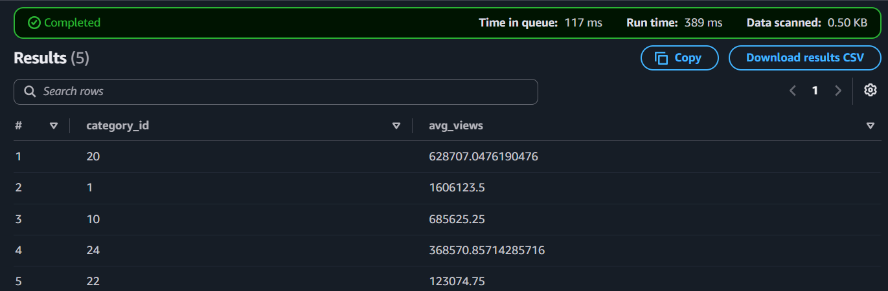

# YouTube Chart Data Pipeline

[](https://github.com/GUOPUCHUN/youtube-trend-pipeline/actions/workflows/ci.yml)

A serverless data pipeline on AWS that ingests the YouTube `mostPopular`
chart daily, transforms it into an analytics-ready columnar format, and
serves it through Athena.

Every resource is defined in Terraform. The entire stack can be created or
destroyed with a single command.


## Why this project

I came to data engineering from a media studies background, so I wanted a
dataset I actually cared about — and a pipeline that would survive being
left alone, rather than one that runs once on a laptop.

The interesting constraint is that chart data is overwritten daily. To
analyse how content performs over time, it has to be captured continuously,
stored immutably, and made queryable cheaply.

## Architecture

| Layer | Service | Purpose |
|---|---|---|
| Orchestration | EventBridge Scheduler | Daily trigger at 05:00 JST |
| Ingestion | Lambda (Python 3.12) | API call with exponential backoff |
| Secrets | SSM Parameter Store | API key, encrypted, never in code |
| Raw zone | S3 (JSON, partitioned) | Immutable source of truth |
| Transformation | Lambda | Validation, flattening, Parquet conversion |
| Curated zone | S3 (Parquet, Snappy) | Analytics-ready |
| Catalog | Glue Data Catalog | Schema with partition projection |
| Query | Athena | Serverless SQL |
| Infrastructure | Terraform | All resources as code |
| CI | GitHub Actions | Lint, format check, tests |

Partitioning follows Hive convention: `dt=YYYY-MM-DD/region=JP/`.

## Design decisions

**Why Lambda over EC2/ECS?**
The job runs for well under a minute, once a day. An always-on instance
would bill continuously for roughly one minute of actual compute. If runtime
ever approached the 15-minute limit, the natural next step would be splitting
the work with Step Functions.

**Why Parquet over CSV/JSON?**
Athena bills per byte scanned, so columnar storage translates directly into
query cost — a query touching three columns reads three columns, not whole
rows. Combined with `dt` partitioning, a single-day query reads only that
day's object rather than the full history, so the saving grows linearly with
retention. At present the pipeline holds one partition, so the two are the
same 0.50 KB; the structure is what makes that stay flat as history
accumulates.

**Why Athena over Redshift?**
The dataset is measured in kilobytes per day. A Redshift cluster would be
over-provisioned by orders of magnitude, and it bills for uptime rather than
usage. Athena's pay-per-query model matches an access pattern of a handful
of queries per day.

**Why partition projection over a Glue crawler?**
Partitions follow a fully predictable daily pattern. Projection removes the
crawler entirely — no schedule, no cost, and no window where a written
partition is not yet queryable.

More detail, including the upstream API change that shaped the schema
validation strategy, is in [docs/decisions.md](docs/decisions.md).

## Engineering practices

- **Idempotent by design** — S3 keys are derived deterministically from the
  partition date, so re-running any day overwrites rather than duplicates.
- **Fail fast on schema drift** — responses are validated with pydantic
  before anything is written. Upstream changes surface as explicit failures,
  not silent corruption. This was verified by deliberately introducing a
  field mismatch and confirming no output file was produced.
- **Retry with classification** — transient failures (429, 5xx, timeouts)
  are retried with exponential backoff, capped at four attempts. Client
  errors (400, 403) fail immediately, since retrying them cannot succeed and
  would only consume Lambda runtime.
- **Least privilege** — the Lambda role can write to the data bucket and
  read one SSM parameter. Nothing else.
- **Infrastructure as code** — Terraform manages all 17 resources.
- **Tested** — 159 tests, 31% coverage. Network calls are mocked with
  `responses`, so the suite consumes no API quota and runs in under a second.

## Cost

Designed to sit inside the AWS free tier:

- Lambda — 30 invocations/month against a 1M-request free tier
- S3 — tens of KB per day, with a 90-day lifecycle rule on the raw zone
- Athena — billed per TB scanned; at this volume, effectively zero
- EventBridge, Glue Catalog — free at this scale
- No NAT Gateway, no VPC, no always-on compute

A budget alert is configured at $1 to catch anything unexpected.

## Repository layout
src/
├── ingest/ API client with retry, Lambda handler
├── transform/ pydantic schemas, flattening, duration parsing
└── common/ S3 and Parquet writers, config resolution
infra/ Terraform: S3, IAM, Lambda, EventBridge, Glue, Athena
tests/unit/ pytest suite, network mocked
sql/ Athena analysis queries
docs/ Architecture diagram, ADRs

## Running it

```bash
cp .env.example .env     # add your YouTube API key and bucket name
pip install -r requirements.txt
python -m src.ingest.handler    # run the pipeline locally

pytest                          # tests
ruff check . && ruff format --check .

cd infra
terraform init
terraform apply                 # provision everything
terraform destroy               # tear it all down
```

## Sample query

```sql
SELECT category_id,
       COUNT(*) AS video_count,
       AVG(view_count) AS avg_views
FROM videos
WHERE dt = '2026-09-10'
GROUP BY category_id
ORDER BY video_count DESC;
```



## What I would do differently at scale

- Replace the single Lambda with Step Functions once ingestion and
  transformation need independent retry semantics.
- Add data quality gates — row count deltas, null rate thresholds — between
  the raw and curated zones.
- Introduce dbt for lineage once there is more than one derived model.
- Add CloudWatch metric filters and SNS alerting; today failures surface in
  logs but do not page anyone.